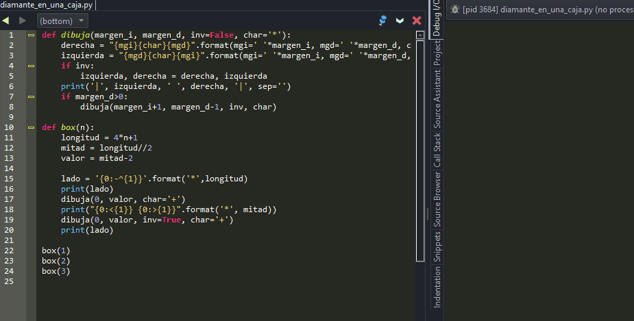
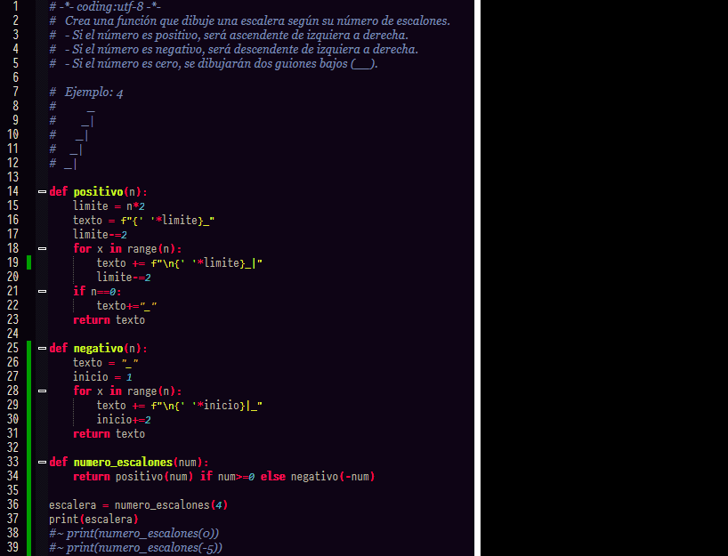

# Resolviendo Problemas
## Diamante en una caja
Escribe la función
caja (n)
obtiene un número entero positivo n, devuelve Ninguno e imprime una imagen ASCII de diamante en una caja.
1. La caja es un cuadrado con una longitud de 4n+1.
2. La parte superior e inferior de la caja deben estar impresas con caracteres "**-**", excepto el  " * " en el medio (consulte el artículo No. 4).
3. Los lados izquierdo y derecho de la caja deben estar impresos con caracteres"|", excepto el " * " en el medio (ver ítem No. 4).
4. Cada vértice de diamante está en el medio de cada lado de la caja y debe estar impreso con el carácter "*".
5. Los lados del diamante deben estar impresos con caracteres "+".
6. La longitud de cada lado del diamante es 2n-1.

> [!IMPORTANT]
> pero tiene limitantes:
> Sólo funciones de recursividad y Strings.
> no para `loops` o `while` o `range`

**Muestra:**
`box(1) => None`
y se imprime lo siguiente:
```
--*--
|+ +|
*   *
|+ +|
--*--
```

Para `box(2)`
```
----*----
|  + +  |
| +   + |
|+     +|
*       *
|+     +|
| +   + |
|  + +  |
----*----
```
### Solucion


---
## Escalera
Crea una función que dibuje una escalera según su número de escalones.
 - Si el número es positivo, será ascendente de izquiera a derecha.
 - Si el número es negativo, será descendente de izquiera a derecha.
 - Si el número es cero, se dibujarán dos guiones bajos (__).
 
**Ejemplo:** para el numero 4
```python
           _
         _|
       _|
     _|
   _|
```
### Solucion


