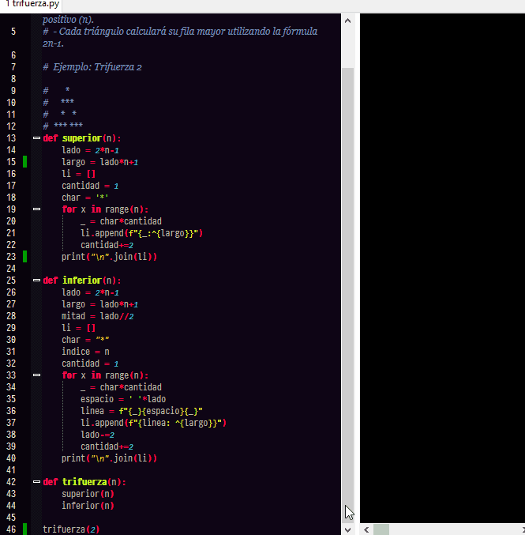
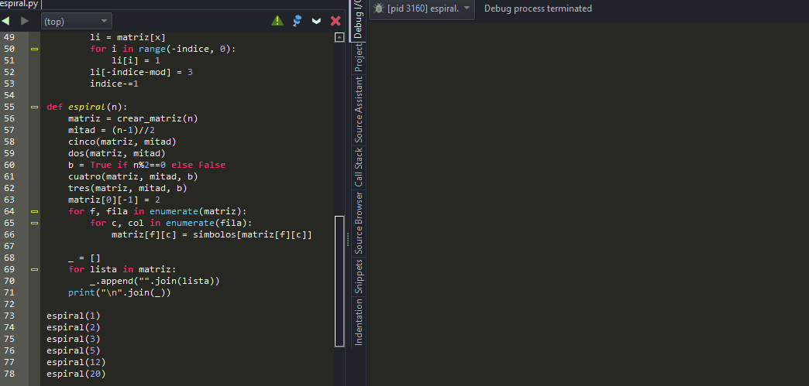
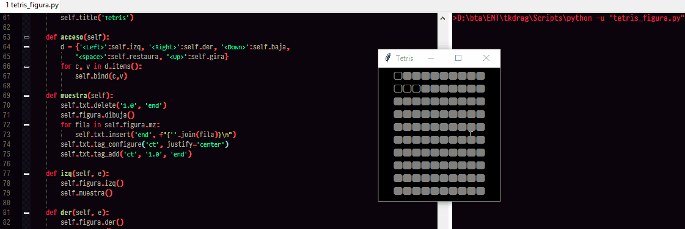
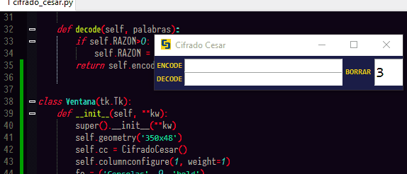

# Resolviendo Problemas
## Diamante en una caja
Escribe la función
caja (n)
obtiene un número entero positivo n, devuelve Ninguno e imprime una imagen ASCII de diamante en una caja.
1. La caja es un cuadrado con una longitud de 4n+1.
2. La parte superior e inferior de la caja deben estar impresas con caracteres "**-**", excepto el  " * " en el medio (consulte el artículo No. 4).
3. Los lados izquierdo y derecho de la caja deben estar impresos con caracteres"|", excepto el " * " en el medio (ver ítem No. 4).
4. Cada vértice de diamante está en el medio de cada lado de la caja y debe estar impreso con el carácter "*".
5. Los lados del diamante deben estar impresos con caracteres "+".
6. La longitud de cada lado del diamante es 2n-1.

> [!IMPORTANT]
> pero tiene limitantes:
> Sólo funciones de recursividad y Strings.
> no para `loops` o `while` o `range`

**Muestra:**
`box(1) => None`
y se imprime lo siguiente:
```
--*--
|+ +|
*   *
|+ +|
--*--
```

Para `box(2)`
```
----*----
|  + +  |
| +   + |
|+     +|
*       *
|+     +|
| +   + |
|  + +  |
----*----
```
### Solucion


---
## Escalera
Crea una función que dibuje una escalera según su número de escalones.
 - Si el número es positivo, será ascendente de izquierda a derecha.
 - Si el número es negativo, será descendente de izquierda a derecha.
 - Si el número es cero, se dibujarán dos guiones bajos (__).
 
**Ejemplo:** para el numero 4
```python
           _
         _|
       _|
     _|
   _|
```
### Solucion


---
## Trifuerza
Crea un programa que dibuje una Trifuerza de "Zelda"
formada por asteriscos.
- Debes indicarle el número de filas de los triángulos con un entero positivo (n).
- Cada triángulo calculará su fila mayor utilizando la fórmula 2n-1.
 
**Ejemplo:** Trifuerza 2
 
```
     *
    ***
   *   *
  *** ***
```
### Solucion


## Espiral
 Crea una función que dibuje una espiral como la del ejemplo.
 * Únicamente se indica de forma dinámica el tamaño del lado.
 * Símbolos permitidos: ═ ║ ╗ ╔ ╝ ╚

 Ejemplo espiral de **lado 5** (5 filas y 5 columnas):
```
 ════╗
 ╔══╗║
 ║╔╗║║
 ║╚═╝║
 ╚═══╝
```

### SOLUCION


## Tetris - figura
Crea un programa capaz de gestionar una pieza de Tetris.
La pantalla de juego tiene 10 filas y 10 columnas representadas por símbolos 🔲
La pieza de tetris a manejar será la siguiente (si quieres, puedes elegir otra):
```
   🔳
   🔳🔳🔳
```

La pieza aparecerá por primera vez en la parte superior izquierda de la pantalla de juego.
```
    🔳🔲🔲🔲🔲🔲🔲🔲🔲🔲
    🔳🔳🔳🔲🔲🔲🔲🔲🔲🔲
    🔲🔲🔲🔲🔲🔲🔲🔲🔲🔲
    🔲🔲🔲🔲🔲🔲🔲🔲🔲🔲
    🔲🔲🔲🔲🔲🔲🔲🔲🔲🔲
    🔲🔲🔲🔲🔲🔲🔲🔲🔲🔲
    🔲🔲🔲🔲🔲🔲🔲🔲🔲🔲
    🔲🔲🔲🔲🔲🔲🔲🔲🔲🔲
    🔲🔲🔲🔲🔲🔲🔲🔲🔲🔲
    🔲🔲🔲🔲🔲🔲🔲🔲🔲🔲
```
 
 * Debes desarrollar una función capaz de desplazar y rotar la pieza en el tablero,
 * recibiendo una acción cada vez que se llame, mostrando cómo se visualiza en la pantalla  de juego.
 * Las acciones que se pueden aplicar a la pieza son: derecha, izquierda, abajo, rotar.
 * Debes tener en cuenta los límites de la pantalla de juego.

### Notas
* para la figura se uso una matriz de 3x3 para asignarle metodos
* cuando se gira la pieza lo hace de modo que usa 3 columnas, por lo que se corrigio el limite cuando la pieza estaba en vertical para que pueda ir hasta el borde
* para las posiciones se uso una tupla con el siguiente orden

### Como quedo


## CIFRADO CESAR
Crea un programa que realize el cifrado César de un texto y lo imprima.
 * También debe ser capaz de descifrarlo cuando así se lo indiquemos.



>El Cifrado de Cesar es uno de los métodos de codificación conocidos más antiguos. Es muy simple - sólo se cambian las posiciones del alfabeto


```
Por ejemplo, con un desplazamiento de 3
la A sería sustituida por la D (situada 3 lugares a la derecha de la A)
la B sería reemplazada por la E
```
